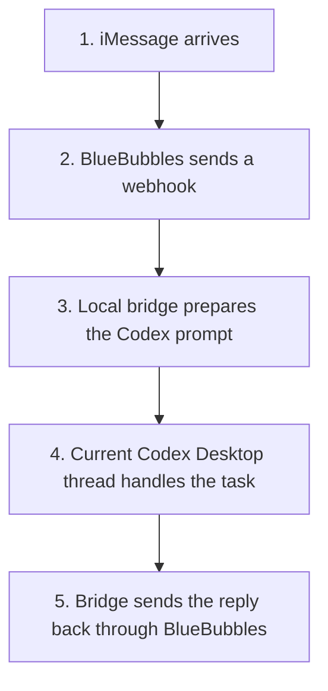

# BlueBubbles Codex Bridge

Self-hosted local macOS bridge from BlueBubbles iMessage webhooks to a user-owned Codex Desktop session.

This is an experimental local automation project. It does not bypass authentication, does not provide hosted messaging infrastructure, and is not affiliated with or endorsed by OpenAI, Apple, or BlueBubbles.

This currently targets macOS only. It depends on BlueBubbles, iMessage, Codex Desktop, and local macOS app automation/debug surfaces.

## Why

This started as a practical replacement for a brittle local iMessage automation stack. OpenClaw-style control was useful for proving the idea, but it was too unstable for daily use. Meanwhile, Codex Desktop kept improving as an actual local operator: better tool access, better long-running task handling, and especially useful desktop capabilities such as Computer Use.

The goal is to keep iMessage transport local through BlueBubbles while letting Codex Desktop handle the agent side.

## Demo

https://github.com/user-attachments/assets/571fe322-5f11-4271-8904-a1785d789de6

## How It Works



## Codex Thread Model

This bridge uses the currently open Codex Desktop thread. It does not create, select, or route to a named Codex thread yet. Before starting the bridge, open the Codex Desktop conversation you want the bridge to use.

Thread selection and named-thread routing are planned future work.

## What It Does

- Receives BlueBubbles webhooks for incoming iMessages.
- Marks incoming messages as read.
- Downloads incoming attachments to local disk.
- Optionally transcribes local audio files when `OPENAI_API_KEY` is configured.
- Marks voice messages as played when using the patched BlueBubbles server/helper branches.
- Keeps typing indicators disabled by default because some iMessage/BlueBubbles setups leave stale indicators visible.
- Sends the prompt into a locally running Codex Desktop window through the local CDP/debug surface.
- Uses the currently open Codex Desktop thread.
- Queues or sends replies back through BlueBubbles.
- Provides local helper endpoints for read, played, typing stop, reactions, attachments, and voice sends.

## Required BlueBubbles Patches

Played receipts require patched BlueBubbles components:

- Server fork: https://github.com/hyungchulc/bluebubbles-server/tree/aria/played-receipts
- Helper fork: https://github.com/hyungchulc/bluebubbles-helper/tree/aria/played-receipts

The forked BlueBubbles repos remain under their upstream Apache-2.0 license. This bridge is separate glue code.

## Safety Model

This bridge can send real iMessages. Start with:

```sh
BRIDGE_AUTO_SEND=false
```

With auto-send off, replies are queued and must be confirmed through the local pending endpoint. Only enable auto-send after testing with your own account or a dedicated test chat.

Do not commit `.env`, logs, state files, downloaded attachments, audio transcript caches, message GUIDs, chat logs, OpenAI keys, BlueBubbles passwords, Apple ID details, Find My locations, or Calendar data.

## Setup

1. Install Node.js 22 or newer.
2. Copy `.env.example` to `.env`.
3. Fill in your local BlueBubbles URL and password.
4. Configure an allowlist with `ALLOWED_CHAT_GUIDS` or `ALLOWED_HANDLES`.
5. Review `prompts/default-system-prompt.md` and customize it for your assistant.
6. Start Codex Desktop with remote debugging:

```sh
scripts/open-codex-debug.sh
```

7. Probe both sides:

```sh
npm run probe:bluebubbles
npm run probe:codex
```

8. Start the bridge:

```sh
npm start
```

Or use the helper script:

```sh
scripts/start-all.sh
```

## BlueBubbles Webhook

Point your BlueBubbles webhook at:

```text
http://127.0.0.1:3099/webhook/bluebubbles
```

If BlueBubbles runs under another macOS user or host, expose only what you need on a trusted local network and keep the bridge bound to localhost whenever possible.

## Important Environment Variables

See `.env.example` for the full list. The key ones are:

- `BLUEBUBBLES_BASE_URL`
- `BLUEBUBBLES_PASSWORD`
- `CODEX_REMOTE_DEBUG_URL`
- `BRIDGE_AUTO_SEND`
- `ALLOWED_CHAT_GUIDS`
- `ALLOWED_HANDLES`
- `OPENAI_API_KEY`
- `BRIDGE_SYSTEM_PROMPT` or `BRIDGE_SYSTEM_PROMPT_FILE`
- `TYPING_INDICATORS_ENABLED`

Use `BRIDGE_SYSTEM_PROMPT_FILE` for your own persona or operating rules instead of hardcoding private instructions into the repo.

On first setup, send a test iMessage such as:

```text
Set yourself up for this bridge. Ask me what you need before turning on auto-send.
```

Keep `BRIDGE_AUTO_SEND=false` until Codex has answered correctly, read/played receipts work, and you have confirmed the pending-send flow.

## Local Endpoints

- `GET /health`
- `POST /ask`
- `POST /webhook/bluebubbles`
- `GET /pending`
- `POST /pending/latest/send`
- `POST /pending/:id/send`
- `POST /bluebubbles/read`
- `POST /bluebubbles/played`
- `POST /bluebubbles/typing/stop`
- `POST /bluebubbles/react`
- `POST /bluebubbles/text/send`
- `POST /bluebubbles/attachment/send`
- `POST /bluebubbles/voice/send`
- `POST /audio/transcribe`

## Audio And Media

Incoming media is handled as local files downloaded from BlueBubbles into `ATTACHMENT_DIR`. Audio transcription is optional. If enabled, the bridge reads the local audio file and sends it to the configured OpenAI-compatible transcription endpoint.

Screenshots or videos are not required for the first public version. A short sanitized demo GIF can help later, but it should show a fake/test contact, fake content, and no real message metadata.

## Future Transports

The bridge is intentionally shaped as:

```text
message transport -> agent runner -> reply sender
```

BlueBubbles is the first transport. Telegram, Discord, Slack, email, or other messaging apps can be added later as separate transport modules without tying the project to iMessage only.

Codex Desktop CDP is the first agent runner. It is experimental and may break if the Codex Desktop app changes its local debug behavior. Future backends could include Codex CLI or the OpenAI API.

Planned Codex runner improvements:

- choose a specific Codex Desktop thread by name or id
- create a dedicated bridge thread during setup
- support multiple conversations with explicit routing
- inspect and change the selected model from the bridge
- inspect and change the selected reasoning/thinking level from the bridge

## License

MIT for this bridge. BlueBubbles server/helper forks keep their upstream Apache-2.0 license.
